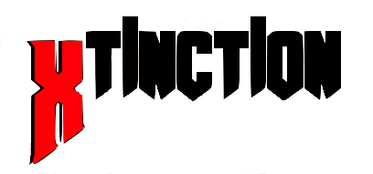
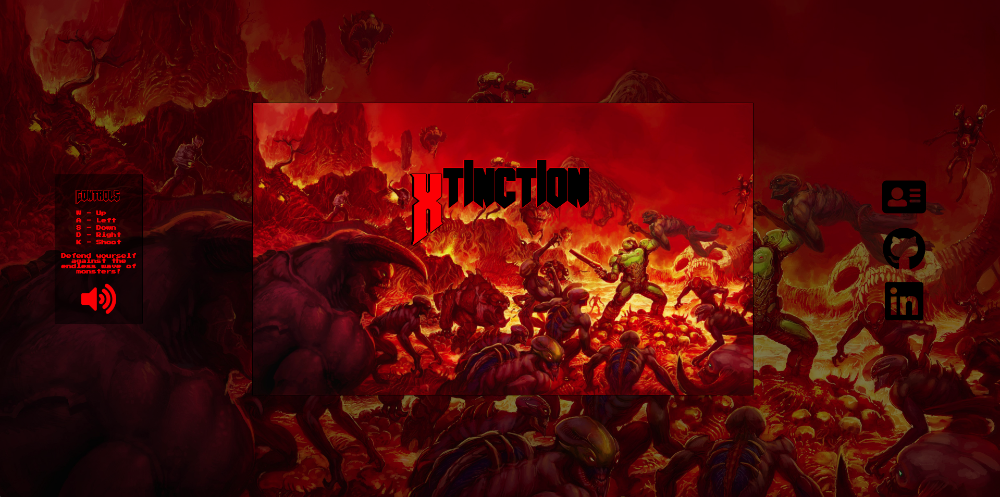

## Background
Xtinction is a survival shooter game where the player defends themselves from waves of hostile monsters.



## Built using canvas and sets a global game state
``` javascript
let canvas = document.getElementById('canvas');
let ctx = canvas.getContext('2d');

let gameTime = 0;
let willReset = false;

let spawnRate = 125;

let leftBullets = [];
let rightBullets = [];
let previousShot = Date.now();

let leftMonsters = [];
let rightMonsters = [];

let hitAnimations = [];
let killAnimations = [];

```
## Renders multiple objects in a single animation frame
``` javascript
function render() {
  if (isGameOver) {
    renderEntity(deadPlayer());
    document.addEventListener('keydown', gameOverOverlay);
  } else {
    renderEntity(Player.duckPlayer);
    document.removeEventListener('keydown', gameOverOverlay);
  }

  leftBullets.forEach( (bullet) => renderEntity(bullet));
  rightBullets.forEach( (bullet) => renderEntity(bullet));

  leftMonsters.forEach( (monster) => { renderEntity(monster); });
  rightMonsters.forEach( (monster) => { renderEntity(monster); });

  hitAnimations.forEach( (hit) => { renderEntity(hit); });
  killAnimations.forEach( (kill) => { renderEntity(kill); });
}
```


## Sprite class handles animations
``` javascript
class Sprite {
  constructor(url, srcPos, srcSize, canvasPos, canvasSize, speed, frames, timed) {
    this.url = url;
    this.srcPos = srcPos;
    this.srcSize = srcSize;
    this.canvasPos = canvasPos;
    this.canvasSize = canvasSize;
    this.speed = typeof speed === 'number' ? speed : 0;
    this.frames = frames;
    this.frameIdx = 0;
    this.timed = timed;
    this.isDone = false;
  }


  updateAnimation(timeDifferential) {
    this.frameIdx += this.speed * timeDifferential;
  }

  render(ctx) {
    let frame;

    if (this.speed > 0) {
      let allFrames = this.frames.length;
      let idx = Math.floor(this.frameIdx);
      frame = this.frames[idx % allFrames];

      if (idx >= this.frames.length) {
        this.isDone = true;
      }
    } else {
      frame = 0;
    }


    let x = this.srcPos[0];
    x += frame * this.srcSize[0];

    let newImage = new Image(this.srcSize[0], this.srcSize[1]);
    newImage.src = this.url;

    if (!this.timed) {
      ctx.drawImage(
        newImage,
        x, this.srcPos[1],
        this.srcSize[0], this.srcSize[1],
        this.canvasPos[0], this.canvasPos[1],
        this.canvasSize[0], this.canvasSize[1]);
    } else if (this.timed && !this.isDone) {
      ctx.drawImage(
        newImage,
        x, this.srcPos[1],
        this.srcSize[0], this.srcSize[1],
        this.canvasPos[0], this.canvasPos[1],
        this.canvasSize[0], this.canvasSize[1]);
    }
  }
}
```

## Collision Detection
``` javascript
function isCollision(
  pos1X, pos1Y, size1X, size1Y,
  pos2X, pos2Y, size2X, size2Y) {
    return (
      pos1X < pos2X + size2X - 50 &&
      pos1X + size1X - 100 > pos2X &&
      pos1Y < pos2Y + size2Y - 70 &&
      size1X + pos1Y > pos2Y
    );
}
```
